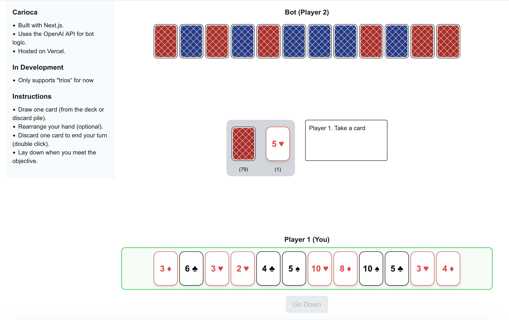

# 🃏 Carioca - Card Game vs Bot (in development)

This is a browser-based implementation of the classic Latin American card game **Carioca**, where you play against a bot. Built with Next.js and powered by the OpenAI API, the bot makes strategic decisions based on the current objective.

> 🚧 This project is **under development**. Currently, you can play against a bot with the first objective: **2 trios**.

---

## 🎮 Live Demo

👉 Play online at https://www.carioca.lat

---

## 📸 Screenshot

---

## ⚙️ Tech Stack

- **Next.js** – React-based web framework  
- **Tailwind CSS** – Utility-first CSS for styling  
- **@dnd-kit** – Drag and drop for card movements  
- **OpenAI API** – Bot logic and decision making  
- **Vercel** – Hosting and deployment  

---

## 🚀 Getting Started

1. Clone the repository:

   git clone https://github.com/mavegaf/carioca-game.git  
   cd carioca-game

2. Install dependencies:

   npm install

3. Create an `.env` file with your OpenAI API key:

   vi .env.local

   Then fill in your key:  
   OPENAI_API_KEY=your-api-key-here

4. Run the development server:

   npm run dev

5. Open http://localhost:3000 in your browser.

---

## 🧠 Game Logic

- The bot uses OpenAI to make decisions like drawing and discarding cards.  
- Currently supports only the **first objective** (`2 trios`).  
- Players can rearrange cards and go down via drag-and-drop.

---

## 📄 License

This project is licensed under the MIT License.

---

## 🙌 Acknowledgments

Inspired by the traditional Carioca card game, with the goal of creating a fun, solo playing experience against an AI opponent.
